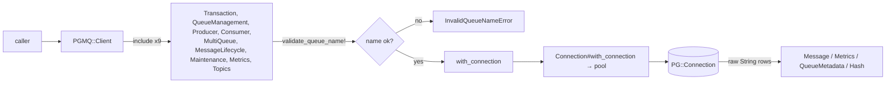

# Client and its operation modules

`PGMQ::Client` (`lib/pgmq/client.rb`, 139 lines) is a small core that `include`s nine modules and owns three things: the `Connection`, the private `with_connection` delegator, and `validate_queue_name!`. Everything a user calls beyond `close`, `stats` and `connection` comes from a module.

## The nine modules

`client.rb:28-36` includes them in this order, and the comment there says the order is for discoverability. Eight live under `lib/pgmq/client/`; `Transaction` is the odd one out at `lib/pgmq/transaction.rb` (it predates the split and is documented in `../connection/summary.md`).

| Module | File | Public methods | What it covers |
|---|---|---|---|
| `QueueManagement` | `client/queue_management.rb` | 5 | `create`, `create_partitioned`, `create_unlogged`, `drop_queue`, `list_queues` |
| `Producer` | `client/producer.rb` | 2 | `produce`, `produce_batch` |
| `Consumer` | `client/consumer.rb` | 5 | `read`, `read_batch`, `read_with_poll`, `read_grouped_rr`, `read_grouped_rr_with_poll` |
| `MultiQueue` | `client/multi_queue.rb` | 3 | `read_multi`, `read_multi_with_poll`, `pop_multi` |
| `MessageLifecycle` | `client/message_lifecycle.rb` | 11 | `pop`, `pop_batch`, `delete*`, `archive*`, `set_vt*` |
| `Maintenance` | `client/maintenance.rb` | 3 | `purge_queue`, `enable_notify_insert`, `disable_notify_insert` |
| `Metrics` | `client/metrics.rb` | 2 | `metrics`, `metrics_all` |
| `Topics` | `client/topics.rb` | 8 | `bind_topic`, `unbind_topic`, `produce_topic`, `produce_batch_topic`, `list_topic_bindings`, `test_routing`, `validate_routing_key`, `validate_topic_pattern` |

39 public methods in total across the eight files, plus `transaction` from the ninth. Zeitwerk eager-loads all of them (`lib/pgmq.rb:6-11`), with `"pgmq" => "PGMQ"` the one inflection.

## Queue-name validation is the injection boundary

`validate_queue_name!` (`client.rb:109-137`) rejects nil/blank, anything 48 characters or longer — so 47 is the longest name that passes — and anything outside `/\A[a-zA-Z_][a-zA-Z0-9_]*\z/`. It raises `Errors::InvalidQueueNameError`.

31 of the 39 public module methods call it. The eight that do not fall into three groups, and none of them is a gap:

- `list_queues` and `metrics_all` take no queue name.
- `produce_topic`, `produce_batch_topic`, `test_routing`, `validate_routing_key`, `validate_topic_pattern` take a routing key or pattern, not a queue name, and pass it as a bound `$1::text` parameter. `list_topic_bindings` validates only in its `queue_name:` branch (`topics.rb:175-177`), because the other branch sends no name at all.
- `read_multi_with_poll` validates only through the `read_multi` call inside its poll loop (`multi_queue.rb:130`); its own guards are the array/size checks at `multi_queue.rb:121-123`.

This matters because two methods build SQL as text instead of binding parameters: `read_multi` (`multi_queue.rb:58-66`) and `pop_multi` (`multi_queue.rb:176-181`) interpolate each queue name into a `UNION ALL` over `pgmq.read` / `pgmq.pop`, and interpolate `vt`, `qty` and `limit` through `to_i`. Both validate every name first and additionally `gsub("'", "''")` it. Everywhere else — 43 `exec_params` calls across the eight modules — values are bound. The only other raw `conn.exec` calls take constant SQL with no interpolation at all (`queue_management.rb:106`, `metrics.rb:42`, `topics.rb:182`).

New SQL belongs in an `exec_params` call. If a method genuinely needs interpolation (a `UNION ALL` over N queues is the reason the two existing ones do), it validates every name first and `to_i`s every number.

## Arity and argument shapes

- Only `queue_name` is positional on the read paths; counts are keywords (`read_batch(queue, vt:, qty:)`, `read_with_poll(queue, vt:, qty:, max_poll_seconds:, poll_interval_ms:)`). `pop_batch(queue_name, qty)` is the exception — its `qty` is positional (`message_lifecycle.rb:39`).
- `read_multi`, `read_multi_with_poll` and `pop_multi` raise `ArgumentError` for a non-Array, an empty Array, or more than 50 queues, before touching the database.
- `delete_multi`, `archive_multi` and `set_vt_multi` raise `ArgumentError` unless given a Hash, return `{}` for an empty one, validate every key, then run the whole set inside `transaction`. They skip queues whose id list is empty, so those keys are absent from the returned Hash rather than mapped to `[]`.
- `produce_batch` and `produce_batch_topic` raise `ArgumentError` when a `headers:` array is present and its length differs from `messages`.

## Overload selection

Several methods pick a SQL overload from the shape of a Ruby value rather than an explicit flag:

- `produce`/`produce_batch`: `headers` present or not (`producer.rb:44-54`, `107-118`).
- `read`/`read_batch`/`read_with_poll`: `conditional.empty?` or not. The non-empty branch calls `conditional.to_json`, and `lib/` never requires the `json` stdlib (nor do `pg` and `connection_pool` load it), so that path works only when the caller has loaded `json` themselves.
- `set_vt`/`set_vt_batch`: `vt.is_a?(Time)` chooses `timestamptz` with `vt.utc.iso8601(6)`, otherwise `integer`. Only `Time` itself takes the timestamp path in this tree — a time-like object that is not a `Time` (an `ActiveSupport::TimeWithZone`, say) falls through to the integer overload.
- `produce_topic`/`produce_batch_topic`: `headers` first, then `delay > 0`, then the two-argument form (`topics.rb:88-103`, `138-154`).

## Return shapes

Because no type map is installed (see `../models/summary.md`), a method returns one of: a `Message`/`Metrics`/`QueueMetadata` built from a row, `nil` when `result.ntuples.zero?`, a String or Array of Strings straight out of the row, a Ruby `true`/`false` from comparing a cell to `"t"`, a Hash with Symbol keys (the `Topics` listing methods and the `*_multi` methods), or `nil` for the three `@return [void]` methods. `produce_topic` is the one place a value is coerced: `result[0]["send_topic"].to_i` (`topics.rb:106`).

`validate_routing_key` is the only method that rescues: it converts a `ConnectionError` whose message contains `"invalid characters"` into `false` and re-raises anything else (`topics.rb:238-242`).
